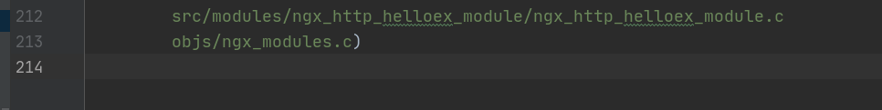
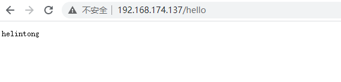

## nginx参数配置


注意无参和有参的对比:
无参
```c
static char *ngx_http_hello(ngx_conf_t *cf, ngx_command_t *cmd, void *conf);
static ngx_int_t ngx_http_hello_handler(ngx_http_request_t *r);

static ngx_command_t  ngx_http_hello_commands[] = {

        { ngx_string("say_hello"),
          NGX_HTTP_LOC_CONF|NGX_CONF_NOARGS,
          ngx_http_hello,
          0,
          0,
          NULL },

        ngx_null_command
};
```
有参
```c
//part 1 声明函数
static ngx_int_t ngx_http_helloex_handler(ngx_http_request_t *r); // 处理函数
static void *ngx_http_helloex_create_loc_conf(ngx_conf_t *cf); // 初始化参数变量
static ngx_int_t ngx_http_helloex_init(ngx_conf_t *cf); // 将处理函数挂在主流程

//part 2 存储用户配置参数的变量
typedef struct {
    ngx_str_t hello_str;
}ngx_http_helloex_conf_t;
//part 3 命令行数组
static ngx_command_t  ngx_http_helloex_commands[] = {

        { ngx_string("say_helloex"),
          NGX_HTTP_LOC_CONF|NGX_CONF_TAKE1,   // 代表放在http的location块,有一个参数
          ngx_conf_set_str_slot,    // 调用系统函数参数处理
          NGX_HTTP_LOC_CONF_OFFSET,
          offsetof(ngx_http_helloex_conf_t, hello_str),
          NULL },
        ngx_null_command
};
```

有参数多了至少一个参数处理函数`ngx_http_helloex_create_loc_conf`和一个保存参数的结构体声明`ngx_http_helloex_conf_t`

然后注意命令行多了ngx_conf_set_str_slot函数回调和获取参数的实际位置的变量。

**参数都会保存到自定义的一个结构体变量里**

## 编译带模块

有关带参数的hello handler模块都能在本项目的src路径中找到。其中前缀是ngx_http_helloex_module的都是还有v2,v3,v4等。

```bash
./configure --prefix=/usr/local/nginx --add-module=src/modules/ngx_http_helloex_module

python makefile2cmakelist.py CMakeLists.txt objs/Makefile
```

如下CMakeLists.txt就编译进去了:


nginx的conf要改为:

```bash
http {
	...
	server {
		...
        location /hello {
            say_helloex helintong;
        }	
    }
}
```
可以看到我在配置中写的参数就被显示出来了。


src\ngx_http_helloex_module_v2路径下的代码实现了字符串拼接,会在给浏览器hello helintong

## nginx自定义参数配置

接下来看src\ngx_http_helloex_module_v3里的代码。我实现了自动处理配置文件的函数。

nginx提供两种配置文件处理方式,第一种是利用系统自带的函数进行配置参数处理

利用系统的参数配置如下:
```c
static ngx_int_t
ngx_http_helloex_init(ngx_conf_t *cf)
{
    ngx_http_handler_pt        *h;
    ngx_http_core_main_conf_t  *cmcf;

    cmcf = ngx_http_conf_get_module_main_conf(cf, ngx_http_core_module);
    /* 将当前的数组分配新的空间,赋给h。
    把ngx_http_helloex_handler变为全局处理函数,
        无论访问什么url当前代码都会运行 */
    h = ngx_array_push(&cmcf->phases[NGX_HTTP_CONTENT_PHASE].handlers);
    if (h == NULL) {
        return NGX_ERROR;
    }

    *h = ngx_http_helloex_handler;

    return NGX_OK;

}
```

自定义参数处理函数:

需要只针对特定位置才执行模块代码时,采用自定义参数处理函数。
当然你可能会问怎么写自定义参数处理函数,跟进ngx_conf_set_str_slot函数照着写即可。(nginx)
```c
// 参数处理照ngx_conf_set_str_slot代码抄即可
//  当需要只针对特定位置才执行模块代码时,采用自定义参数处理函数
static char *ngx_http_helloex(ngx_conf_t *cf, ngx_command_t *cmd, void *conf)
{
    // 有参的参数的处理
    char  *p = conf;

    ngx_str_t        *field, *value;
    ngx_conf_post_t  *post;

    field = (ngx_str_t *) (p + cmd->offset);

    if (field->data) {
        return "is duplicate";
    }

    value = cf->args->elts;

    *field = value[1];

    ngx_http_core_loc_conf_t  *clcf;

    clcf = ngx_http_conf_get_module_loc_conf(cf, ngx_http_core_module);
    clcf->handler = ngx_http_helloex_handler;

    if (cmd->post) {
        post = cmd->post;
        return post->post_handler(cf, post, field);
    }

    return NGX_CONF_OK;
}
```

## 合并配置信息

如果该配置能在不同块中配置会如何呢?

参照src\ngx_http_helloex_module_v4的代码。

```c
static ngx_command_t  ngx_http_helloex_commands[] = {

        { ngx_string("say_helloex"),
        // 如果只有NGX_HTTP_SRV_CONF则根本不需要写merge方法
        // 多层配置合并仅在配置域在两个或以上时才需要(上下级关系才会需要merge)
          NGX_HTTP_SRV_CONF|NGX_HTTP_LOC_CONF|NGX_CONF_TAKE1,   
          //ngx_http_helloex,
          ngx_conf_set_str_slot,
          NGX_HTTP_LOC_CONF_OFFSET,
          offsetof(ngx_http_helloex_conf_t, hello_str),
          NULL },
        ngx_null_command
};
```

注意`NGX_HTTP_SRV_CONF|NGX_HTTP_LOC_CONF`代表了该配置命令可以在server块也可在location种配置。这时候怎么选择呢？就需要合并配置的方法了。

相较于src\ngx_http_helloex_module_v3的代码多了

```c
static char *ngx_http_helloex_merge_loc_conf(ngx_conf_t *cf, void *parent, void *child);
// 合并配置处理函数

// 合并不同级参数的处理函数
static char *
ngx_http_helloex_merge_loc_conf(ngx_conf_t *cf, void *parent, void *child)
{
    ngx_http_helloex_conf_t *prev = parent; // 拿到上层的参数
    ngx_http_helloex_conf_t *conf = child; // 下层的参数
    // 合并处理,当当前child没有配置参数时使用上一层参数,有则取层级更低的一层
    ngx_conf_merge_str_value(conf->hello_str, prev->hello_str, "");

    return NGX_CONF_OK;
}
```

这里还需要注意一点下面是挂载handler的操作。挂载后该代码变为全局无论如何都要运行。

请注意: 多层级合并配置处理无法处理特定url,且只能使用系统配置处理函数换句话说只有ngx_array_push(&cmcf->phases[NGX_HTTP_CONTENT_PHASE].handlers)变为全局函数才会生效。

所以相应的也应该知道自定义配置保存的意义所在了。

```c
static ngx_int_t
ngx_http_helloex_init(ngx_conf_t *cf)
{
    ngx_http_handler_pt        *h;
    ngx_http_core_main_conf_t  *cmcf;

    cmcf = ngx_http_conf_get_module_main_conf(cf, ngx_http_core_module);
    /* 将当前的数组分配新的空间,赋给h。
    把ngx_http_helloex_handler变为全局处理函数,
        无论访问什么url当前代码都会运行 */
    h = ngx_array_push(&cmcf->phases[NGX_HTTP_CONTENT_PHASE].handlers);
    if (h == NULL) {
        return NGX_ERROR;
    }

    *h = ngx_http_helloex_handler;


    return NGX_OK;

}

```

下一章 [文件断点续传](04file_trans.md)