## nginx开发

nginx的调式是困难的因为它是事件驱动的服务器,那么采用更加先进的IDE必然可以更好的去进行nginx的开发,所以我决定做一套用clion做nginx二次开发的教程。

### clion基础快捷键

|快捷键|描述|
|------|------|
|F8|单步调试|
|ALT+SHIFT+F8|强制单步运行|
|F7|跳入函数|
|SHIFT+F8|跳出函数|
|F9|恢复到正常运行|

clion的断点管理和变量监控

鼠标点相应行左侧即可下断点,红点出现断点就生效了。

### 用clion优雅的调试nginx

clion调试nginx总共分4步: nginx的configure配置 -> clion导入 -> python脚本根据objs下的makefile修改clion生成的CMakeLists.txt -> 修改nginx配置然后调试

1. nginx源码下载解压

在编译源码之前,需要安装nginx的一些依赖。要安装如下软件

gcc,pcre,pcre-devel,zlib,zlib-devel,openssl,openssl-devel。

执行如下指令
```shell
./configure --prefix=/root/nginx-1.16.0
```
--prefix是指生成的文件夹。

执行成功如下图:
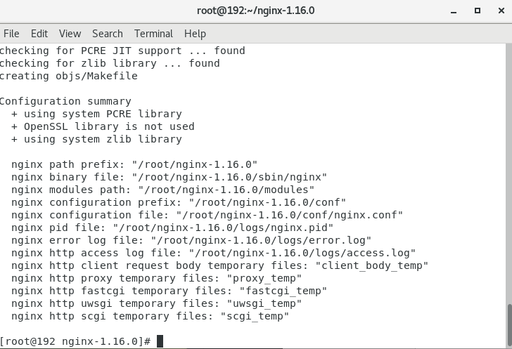

这会生成objs的src其中有非常重要的三个源文件`nginx_auto_config.h, nginx_auto_header.h, ngx_modules.h`。clion需要引入这几个文件。

2. 利用Clion从nginx源码根路径导入

导入过程如下图:

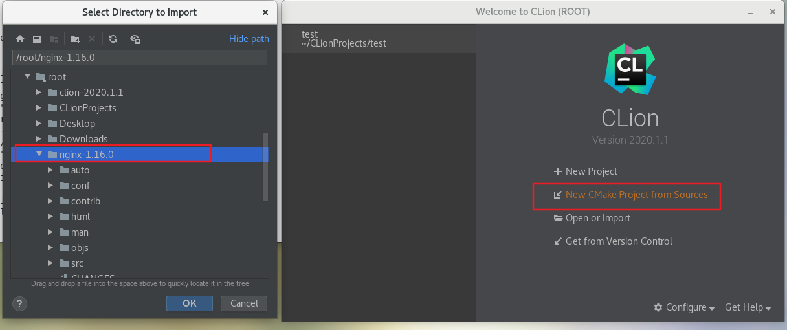

导入过后会自动勾选一部分代码然后clion会自动勾选一些代码。

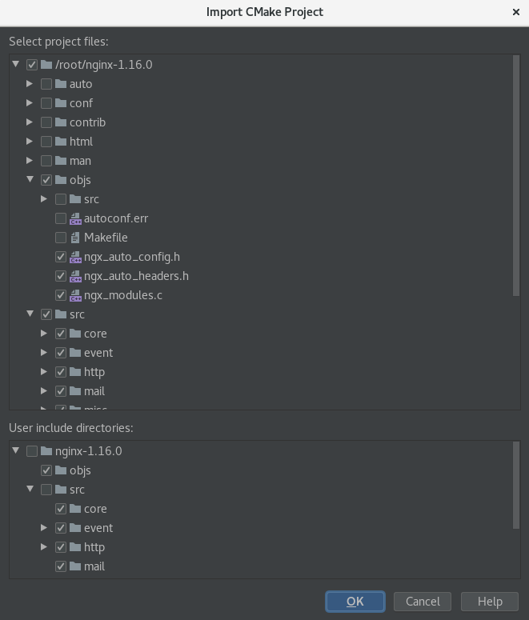

此时你可以通过如下图
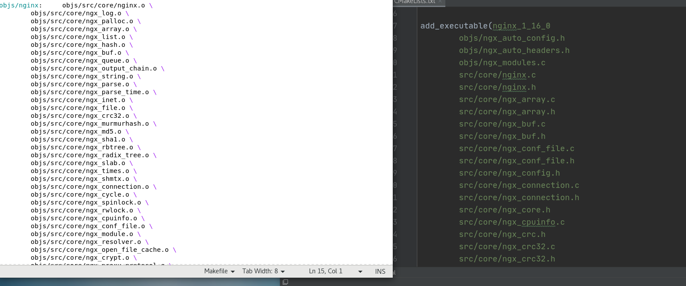
对比makefile和CMakeLists的区别来修改clion自动生成的CMakeLists。因为clion默认是通过代码全部编译,这里和./configure的执行情况有所不同。所以可以写一个脚本来改造CMakeLists

3. 通过脚本修改clion生成的cmake

该脚本在 [makefile2cmakelist.py](https://github.com/helintongh/nginx-1.16.0/blob/master/src/py/makefile2cmakelist.py)
```shell
python makefile2cmakelist.py CMakeLists.txt objs/Makefile
```

此时就可用clion进行构建nginx了。直接看图

构建如下图即可
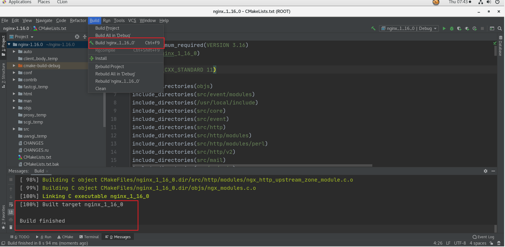

清除生成的文件如下即可
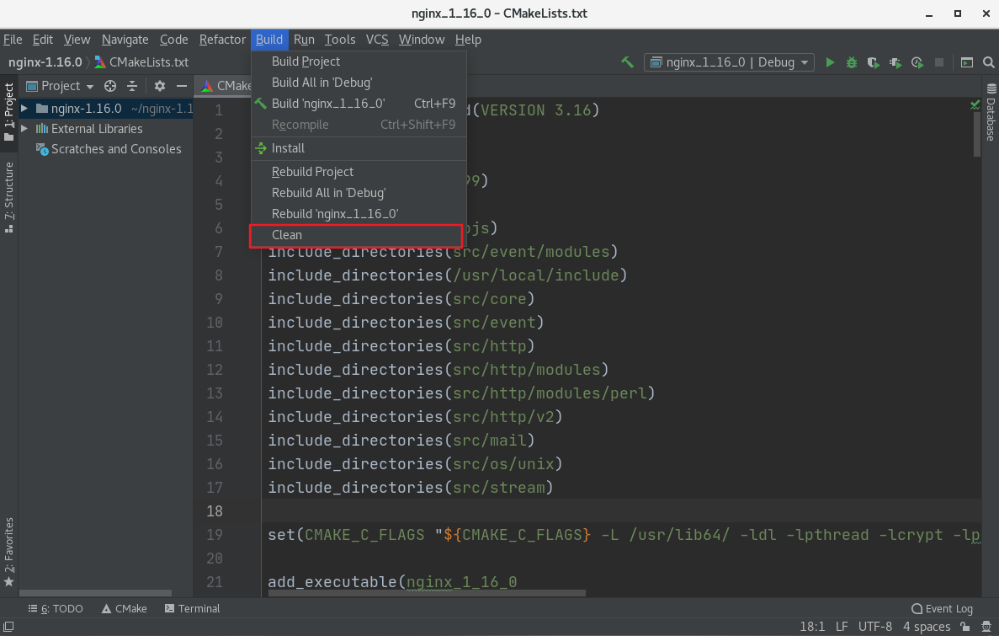

4. 修改配置

此时能够编译通过生成可执行文件但是有可能无法运行(通过Clion Run来运行的话)。还有几个几个小步骤。

首先看下面的报错如图:

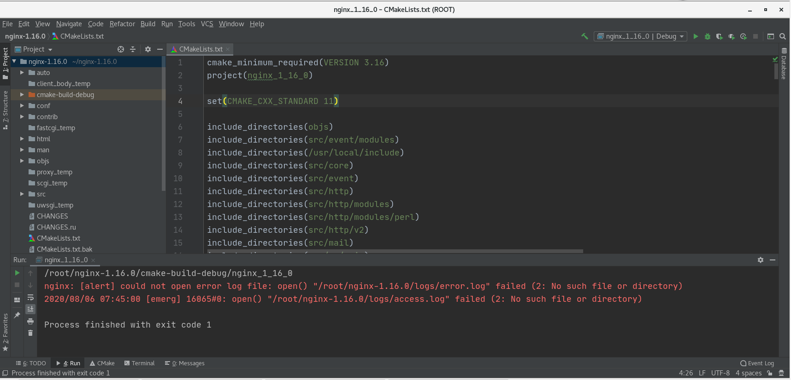

上面是因为运行nginx的时候缺少logs文件夹,这时候需要手动`mkdir logs` 生成logs文件夹,就可运行了。如果是端口被占用那么`kill` 掉占用80端口的进程即可。

下面可运行后可以通过
```shell
ps -ef | grep nginx
```
执行结果如下图:
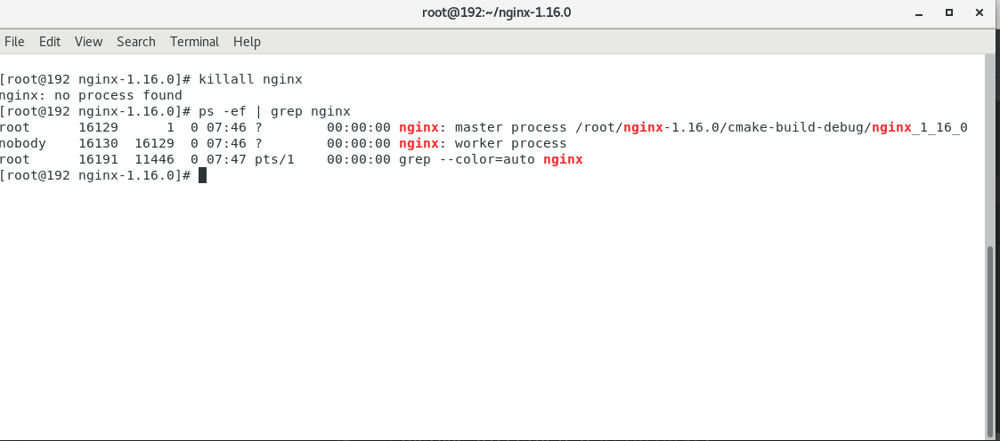
可以看到现在运行的nginx是带了1.16后缀的。

此时通过浏览器访问127.0.0.1会出现如下图:


还需要修改nginx的配置才能更好的调式。
首先修改用户名,如下图:
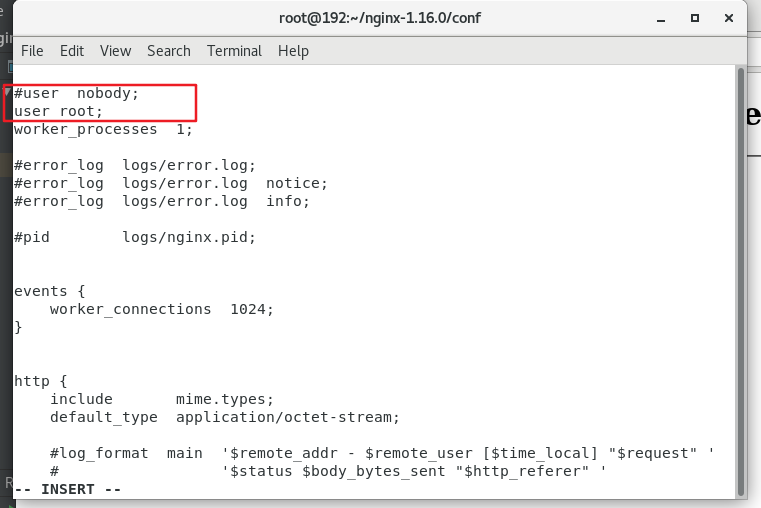
我这台计算机使用的是root用户所以改为root用户,这样浏览器访问127.0.0.1就如下图了。
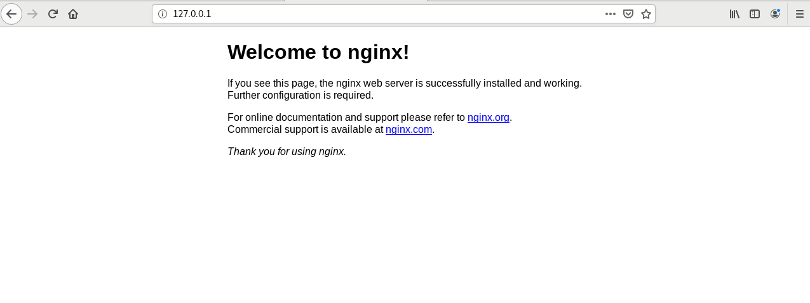

与此同时还有一个很重要的操作修改如下图:
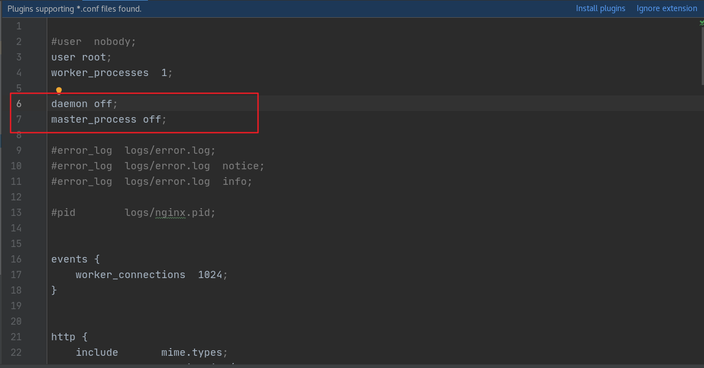

daemon和master_process,daemon off是让当前nginx不是后台运行(非守护进程),master_process off是让nginx不以master/worker方式工作让其变为只有一个进程方便调试。

### 编译不带后缀的nginx

依次执行如下语句:

```shell
tar -zxvf nginx-1.16.0.tar.gz # 解压nginx
mv nginx-1.16.0 nginx # 改名
cp -r nginx /usr/local/ # 放到默认路径下
cd /usr/local/nginx
./configure --prefix=/usr/local/nginx
```
然后用Clion导入/usr/local/nginx路径重复上述步骤即可。

### nginx调试实战

下面我将来调试nginx的http处理模块

src路径下找到http,在http找到`ngx_http_core_module.c`,找到函数ngx_http_handler
这个函数来接收用户请求的,用户请求一进来到了这个函数。打如下图的断点:
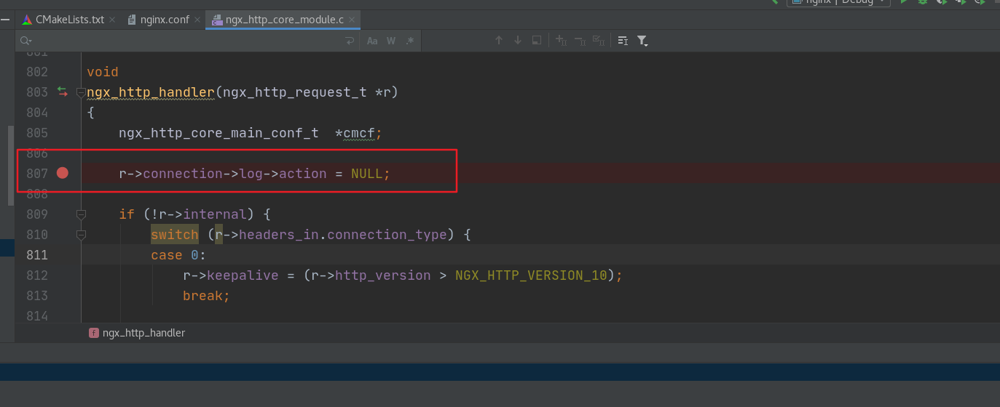
然后运行,主义运行不是普通模式而是调试模式(点右上角的小虫子或SHIFT+F9)

此时按F8(单步运行)也不能运行因为没有请求过来根本运行不到这段代码。

通过浏览器访问127.0.0.1的nginx页面会卡住,卡在了断点的地方。

Clion的调试框如下图:

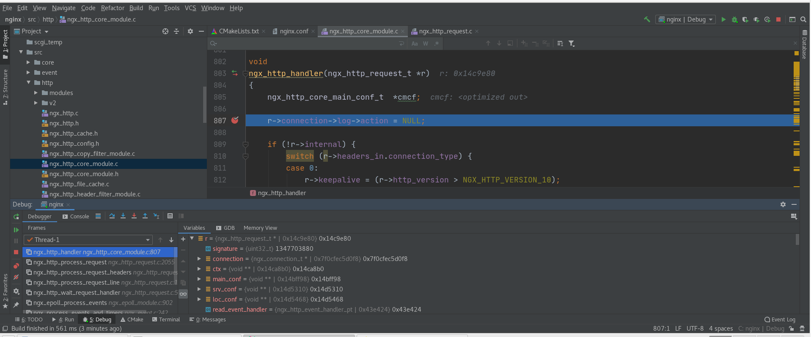
可以看到请求进入后r中所有的请求信息,包括url等等信息。

然后按F8向下运行,再按多个F9直到没有效果(这个请求的处理结束了)。

再在浏览器中输入`http://127.0.0.1/index.html?qq=10000`
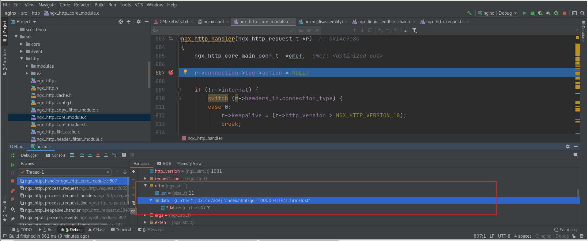 
这样就看到了吧,nginx的接收请求的过程能完全被我们所把控。

### 开发一个模块的步骤

在nginx src(**不是objs路径下的src**)路径下,新建一个文件夹modules然后再新建一个文件夹ngx_http_hello_module,在该文件夹下新增config和ngx_http_hello_module.c两个文件。一个是模块的配置,一个是源文件。

新建后代码结构如下图:

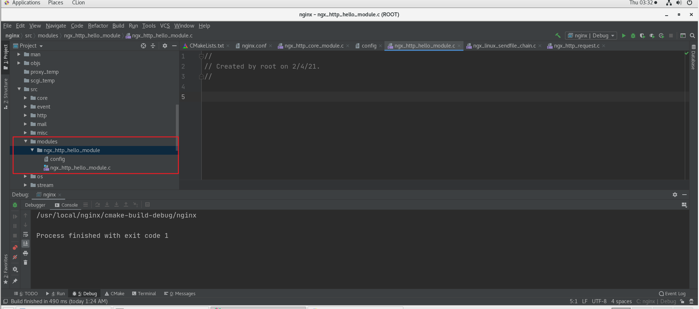

注意代码结构每一个模块都新建一个文件夹。

先写配置文件config

第一项是插件名称,第二项是代表其为http的模块,第三项是指定源文件

```shell
ngx_addon_name=ngx_http_hello_module
HTTP_MODULES="$HTTP_MODULES ngx_http_hello_module"
NGX_ADDON_SRCS="$NGX_ADDON_SRCS $ngx_addon_dir/ngx_http_hello_module.c"
```
编译指令要改为(此步骤要在你自己的nginx路径下我的在/usr/local/nginx):
```shell
./configure --prefix=/usr/local/nginx --add-module=src/modules/ngx_http_hello_module
```
执行结果注意下图红框标识的
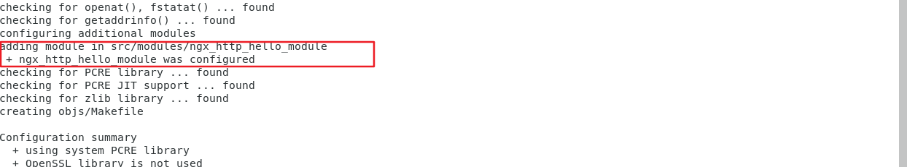
当出现红框的字段标识已经把模块新增进去了。

再执行上面的提到过的脚本 [makefile2cmakelist.py](https://github.com/helintongh/nginx-1.16.0/blob/master/src/py/makefile2cmakelist.py)

```shell
python makefile2cmakelist.py CMakeLists.txt objs/Makefile
```
执行该脚本后成功修改了CMakeLists.txt,就可以通过Clion把插件编译进去了。

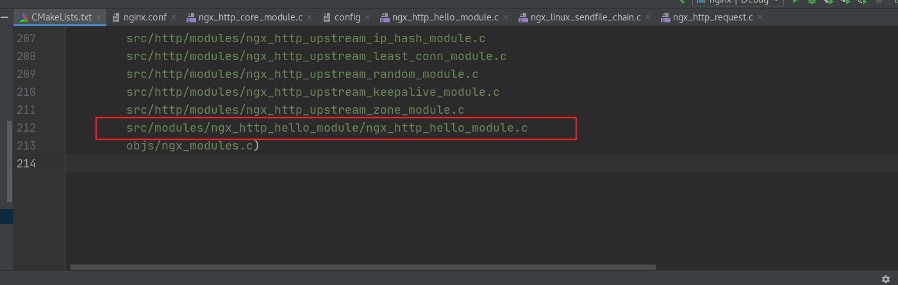

### nginx模块关键代码结构

看别人的源码是最好的学习方式。所以关注ngx_http_stub_status_module.c,这一个nginx的原生代码就能明白。(路径在nginx/src/http/modules/ngx_http_stub_status_module.c)

修改掉它的业务代码可以变为如下代码
```c
//
// Created by helintong on 2/4/21.
//
#include <ngx_config.h>
#include <ngx_core.h>
#include <ngx_http.h>

static char *ngx_http_hello(ngx_conf_t *cf, ngx_command_t *cmd, void *conf);
static ngx_int_t ngx_http_hello_handler(ngx_http_request_t *r);
// say_hello是写在配置文件中的
static ngx_command_t  ngx_http_hello_commands[] = {

        { ngx_string("say_hello"),
          NGX_HTTP_LOC_CONF|NGX_CONF_NOARGS, // 让其允许配置到locatino中,没有参数
          ngx_http_hello,
          0,
          0,
          NULL },

        ngx_null_command
};


static ngx_http_module_t  ngx_http_hello_module_ctx = {
        NULL,                                   /* preconfiguration */
        NULL,                                  /* postconfiguration */

        NULL,                                  /* create main configuration */
        NULL,                                  /* init main configuration */

        NULL,                                  /* create server configuration */
        NULL,                                  /* merge server configuration */

        NULL,                                  /* create location configuration */
        NULL                                   /* merge location configuration */
};

ngx_module_t  ngx_http_hello_module = {
        NGX_MODULE_V1,
        &ngx_http_hello_module_ctx,      /* module context */
        ngx_http_hello_commands,              /* module directives */
        NGX_HTTP_MODULE,                       /* module type */
        NULL,                                  /* init master */
        NULL,                                  /* init module */
        NULL,                                  /* init process */
        NULL,                                  /* init thread */
        NULL,                                  /* exit thread */
        NULL,                                  /* exit process */
        NULL,                                  /* exit master */
        NGX_MODULE_V1_PADDING
};

static char *
ngx_http_hello(ngx_conf_t *cf, ngx_command_t *cmd, void *conf)
{
    ngx_http_core_loc_conf_t  *clcf;

    clcf = ngx_http_conf_get_module_loc_conf(cf, ngx_http_core_module);
    clcf->handler = ngx_http_hello_handler;

    return NGX_CONF_OK;
}
// 用来处理http请求的函数
static ngx_int_t ngx_http_hello_handler(ngx_http_request_t *r)
{
    ngx_chain_t        out;
    
    return ngx_http_output_filter(r, &out);
}
```

可以看到该源文件分为这几个部分。

1. 模块配置结构(无参就没有,比如上面就没有)
2. 模块配置指令 `ngx_command_t`
3. 模块上下文结构 `ngx_http_module_t`
4. 模块的上下文定义 `ngx_http_hello_module_ctx`
5. 模块的挂载函数
6. 真正的处理函数。

```bash
http{
    server {
    ...
        location / {
            say_hello;
        }
    }
    ...
}
```

然后通过上面把该模块编入并且打断点,可以发现nginx确实卡在了断点处。

接下来我们来扩展这一个函数,让其实现打印hello world。

[源代码路径](../src/ngx_http_hello_module/ngx_http_hello_module.c) 具体看源代码吧,这段代码对挂载函数写的不够详细会在下一章中详解。

```c
//
// Created by helintong on 2/4/21.
//
#include <ngx_config.h>
#include <ngx_core.h>
#include <ngx_http.h>

static char *ngx_http_hello(ngx_conf_t *cf, ngx_command_t *cmd, void *conf);
static ngx_int_t ngx_http_hello_handler(ngx_http_request_t *r);

static ngx_command_t  ngx_http_hello_commands[] = {

        { ngx_string("say_hello"),
          NGX_HTTP_LOC_CONF|NGX_CONF_NOARGS,
          ngx_http_hello,
          0,
          0,
          NULL },

        ngx_null_command
};


static ngx_http_module_t  ngx_http_hello_module_ctx = {
        NULL,    /* preconfiguration */
        NULL,                                  /* postconfiguration */

        NULL,                                  /* create main configuration */
        NULL,                                  /* init main configuration */

        NULL,                                  /* create server configuration */
        NULL,                                  /* merge server configuration */

        NULL,                                  /* create location configuration */
        NULL                                   /* merge location configuration */
};

ngx_module_t  ngx_http_hello_module = {
        NGX_MODULE_V1,
        &ngx_http_hello_module_ctx,      /* module context */
        ngx_http_hello_commands,              /* module directives */
        NGX_HTTP_MODULE,                       /* module type */
        NULL,                                  /* init master */
        NULL,                                  /* init module */
        NULL,                                  /* init process */
        NULL,                                  /* init thread */
        NULL,                                  /* exit thread */
        NULL,                                  /* exit process */
        NULL,                                  /* exit master */
        NGX_MODULE_V1_PADDING
};

static char *
ngx_http_hello(ngx_conf_t *cf, ngx_command_t *cmd, void *conf)
{
    ngx_http_core_loc_conf_t  *clcf;
    /* 首先找到say_hello配置项所属的配置块，clcf貌似是location块内的数据
     结构，事实上不然。它能够是main、srv或者loc级别配置项，也就是说在每一个
     http{}和server{}内也都有一个ngx_http_core_loc_conf_t结构体 */
    clcf = ngx_http_conf_get_module_loc_conf(cf, ngx_http_core_module);

    /* http框架在处理用户请求进行到NGX_HTTP_CONTENT_PHASE阶段时。假设
      请求的主机域名、URI与say_hello配置项所在的配置块相匹配，就将调用我们
      实现的ngx_http_hello_handler方法处理这个请求
    */
    clcf->handler = ngx_http_hello_handler;

    return NGX_CONF_OK;
}

static ngx_int_t ngx_http_hello_handler(ngx_http_request_t *r)
{
    // 1. 处理http的header
    /* 为了处理客户端请求的请求体，nginx提供了ngx_http_read_client_request_body(r, post_handler)和ngx_http_discard_request_body(r)函数。
        第一个函数读取请求正文，并通过request_body请求字段使其可用。
        第二个函数指示nginx丢弃(读取和忽略)请求体。每个请求都必须调用其中一个函数。
        通常，内容处理程序会有这两个函数的调用。
    */
    // 这里直接丢弃请求体
    ngx_int_t rc = ngx_http_discard_request_body(r);
    if(rc != NGX_OK)
    {
        return rc;
    }
    // ngx_http_request_t *r是接收的http请求结构,与此同时它也保存返回给客户端
    ngx_str_t type = ngx_string("text/plain");
    ngx_str_t content = ngx_string("hello world!");
    // r的headers_out的内容就是返回给客户端的http头的内容
    r->headers_out.content_type = type;
    r->headers_out.content_length_n = content.len;
    r->headers_out.status = NGX_HTTP_OK;
    rc = ngx_http_send_header(r); // 该函数发送http头(r的内容)给客户端
    if(rc != NGX_OK)
    {
        return rc;
    }

    // 2.处理http的body体

    // http body要写入out里面(通过chain串起来)
    /* 对chain链要做两个操作,
        1. 挂一个结点 out.buf = b;
        2. 标志指针域 out.next = NULL; 
    */
    /* 填充结点内容 */
    // ngx_create_temp_buf相当于malloc,第一个参数是指定内存池,第二个参数是内容大小
    ngx_buf_t *b = ngx_create_temp_buf(r->pool, content.len);
    if(NULL == b)
    {
        return NGX_HTTP_INTERNAL_SERVER_ERROR;
    }
    // 复制内容到b结点里,参数为b起始位置,content内容,数据长度
    ngx_memcpy(b->pos, content.data, content.len);
    b->last = b->pos + content.len; // 指定结点b末尾
    b->last_buf = 1; // 指明只有这一块buf没有分块

    ngx_chain_t        out;
    out.buf = b; //
    out.next = NULL; // 该示例只有一个结点
    
    return ngx_http_output_filter(r, &out);
}
```

由上面可以知道handler模块开发总共分为这三步:

1. 编写模块基本结构。包括模块的定义，模块上下文结构，模块的配置结构等。
2. 实现handler的挂载函数。根据模块的需求选择正确的挂载方式。
3. 编写handler处理函数。模块的功能主要通过这个函数来完成。

### config文件的编写

```config
ngx_addon_name=ngx_http_hello_module
HTTP_MODULES="$HTTP_MODULES ngx_http_hello_module"
NGX_ADDON_SRCS="$NGX_ADDON_SRCS $ngx_addon_dir/ngx_http_hello_module.c"
```

注意只需要在原来把ngx_http_hello_module.c改为上面即可。运行nginx然后关闭防火墙可以看到展示。


结果如下,可以看到通过浏览器显示出了hello world:


下一章 [handler模块实战](./02hello_handler.md)