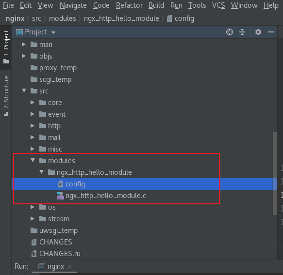
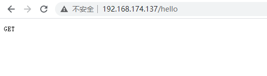
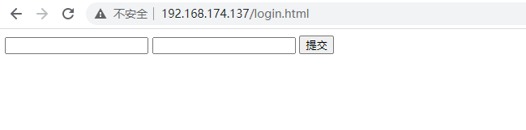
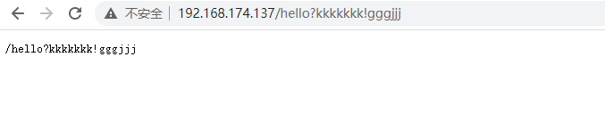
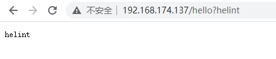
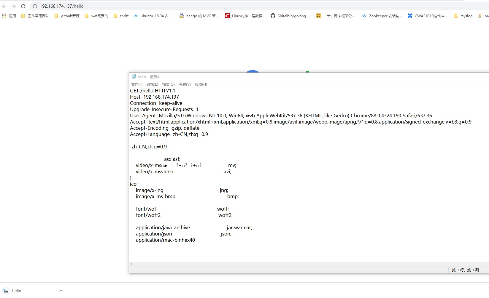
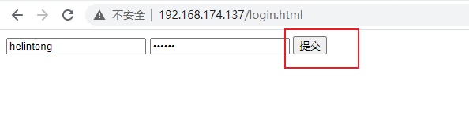
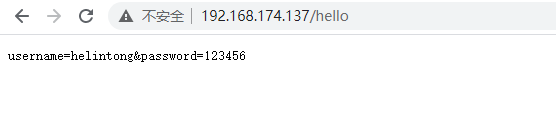

## http handler模块深入实战探索

上文知道了最基础的handler模块需要:

1. 编写模块基本结构。包括模块的定义，模块上下文结构，模块的配置结构等。
2. 实现handler的挂载函数。根据模块的需求选择正确的挂载方式。
3. 编写handler处理函数。模块的功能主要通过这个函数来完成。

本章将讲解nginx针对http头的处理,http的body的处理。还是无参模块,带参数模块的处理将专门做一章节讲解。

## nginx的ngx_http_request_s结构

nginx通过ngx_http_request_s来管理http的各种字段。同时nginx第三方模块可以处理获取这些信息。

1. request method:保存http请求的方法(是GET,POST,DELETE...)
2. request URI/URL:保存URI和URL
3. request protocol:保存协议名
4. request header_in headers_in:header_in是原始请求头,headers_in是处理过后的请求头(可以返回给前端)
5. request body: post请求会带有body体,同样放在这个结构体里。

有关http头或body相应操作的示例代码放在:

[示例1](../src/ngx_http_hello_module_v2/ngx_http_hello_module.c)
[示例2](../src/ngx_http_hello_module_v3/ngx_http_hello_module.c)

如果你按照第一章把代码编进去了就只需要把文件内容复制到里面即可。

代码结构如下图


## 判断http的方法
着重看处理函数:

先来实现把判断http的请求类型然后将其返回给用户。整体代码如下

```c++
static ngx_int_t ngx_http_hello_handler(ngx_http_request_t *r)
{

    ngx_int_t rc = ngx_http_discard_request_body(r);
    if(rc != NGX_OK)
    {
        return rc;
    }

    ngx_str_t content;
    /* 1.获取http请求的是什么方法 */
    // 这里有一个坑点,提交表单的情况nginx转换过后只有GET和POST请求
    switch(r->method)
    {
        case NGX_HTTP_PUT:
        ngx_str_set(&content, "PUT");
            break;
        case NGX_HTTP_GET:
        ngx_str_set(&content, "GET");
            break;
        case NGX_HTTP_POST:
        ngx_str_set(&content, "POST");
            break;
        default:
            ngx_str_set(&content, "OTHERS");
    }
    ngx_str_t type = ngx_string("text/plain");
    //ngx_str_t content = ngx_string("hello world!");
    r->headers_out.content_type = type;
    r->headers_out.content_length_n = content.len;
    r->headers_out.status = NGX_HTTP_OK;
    rc = ngx_http_send_header(r); // 该函数发送http头(r的内容)给客户端
    if(rc != NGX_OK)
    {
        return rc;
    }

    // ngx_create_temp_buf相当于malloc,第一个参数是指定内存池,第二个参数是内容大小
    ngx_buf_t *b = ngx_create_temp_buf(r->pool, content.len);
    if(NULL == b)
    {
        return NGX_HTTP_INTERNAL_SERVER_ERROR;
    }
    // 复制内容到b结点里,参数为b起始位置,content内容,数据长度
    ngx_memcpy(b->pos, content.data, content.len);
    b->last = b->pos + content.len; // 指定结点b末尾
    b->last_buf = 1; // 指明只有这一块buf没有分块

    ngx_chain_t        out;
    out.buf = b; //
    out.next = NULL; // 该示例只有一个结点

    return ngx_http_output_filter(r, &out);
}
```

核心代码:

```c++
ngx_str_t content;
/* 1.获取http请求的是什么方法 */
// 这里有一个坑点,提交表单的情况nginx转换过后只有GET和POST请求
switch(r->method)
{
    case NGX_HTTP_PUT:
    ngx_str_set(&content, "PUT");
        break;
    case NGX_HTTP_GET:
    ngx_str_set(&content, "GET");
        break;
    case NGX_HTTP_POST:
    ngx_str_set(&content, "POST");
        break;
    default:
        ngx_str_set(&content, "OTHERS");
}
```
上述代码是把客户端http的方法做一个判断然后写入到content里面。
先来测试GET方法结果如下。



然后测试POST方法会比较麻烦。把如下html代码写为login.html放入nginx的html路径下。


```html
<!DOCTYPE html>
<html lang="en">
<head>
	<meta charset="UTF-8">
	<title>Title</title>
</head>
<body>
	<form method="POST" action="/hello">
		<input type="text" name="username" id="uname">
		<input type="password" name="password" id="pwd">
		<input type="submit" id="submit">
	</form>
</body>
</html>
```
上面就是实现了一个post请求请求后跳转到/hello路径。


输入数据后点击提交会跳转到如下页面:


可以看到POST信息也能判断出来。

可以试着把html文件的method改为DELETE还是判断为POST或者GET。html提交表单的情况nginx转换过后只有GET和POST请求

## 获取请求的uri

这里我的源文件里面把获取uri的代码和获取uri参数的代码注释掉了。我的代码注释非常清楚,要实验获取请求的uri直接消掉注释,然后把判断请求给注释就可以了。

核心代码如下:

```c
    /* 1.获取http请求的是什么方法 */
    // 这里有一个坑点,提交表单的情况nginx转换过后只有GET和POST请求
    // switch(r->method)
    // {
    //     case NGX_HTTP_PUT:
    //     ngx_str_set(&content, "PUT");
    //         break;
    //     case NGX_HTTP_GET:
    //     ngx_str_set(&content, "GET");
    //         break;
    //     case NGX_HTTP_POST:
    //     ngx_str_set(&content, "POST");
    //         break;
    //     default:
    //         ngx_str_set(&content, "OTHERS");
    // }
    /* part 1 end */

    /* 注:与uri有关的需要把前端的POST方法改成GET方法。
            uri参数GET获取的仅需header。
            POST则把数据放到body里面取不到。
    */
    /* 2. 获取请求的uri,
        注:我使用的是同一变量content要看效果要注释非2 part的代码,后面的part亦然 */
    content = r->uri; // 该语句只能获取到最基础的uri没法获取uri参数
    content.data = r->uri_start;
    content.len = r->uri_end - r->uri_start;
    /* part 2 end */
```

运行结果如下(当然我更加建议通过断点查看变量值更直观,记得要访问/hello的路由才会进入断点):


```c
    content = r->args; // 获取所有参数
    content.data = r->args_start;
    content.len = r->uri_end - r->args_start;
```
代码变为上面就是获取参数。

在浏览器输入 `http://192.168.174.137/hello?helint` 注意ip得是你自己的虚拟机的ip或者主机ip才能访问。

结果如下:



可以发现nginx非常轻易的获取到了路由后面的参数helint。

## nginx获取原始请求头和格式化后的http头信息

完整处理函数如下。
```c
static ngx_int_t ngx_http_hello_handler(ngx_http_request_t *r)
{

	ngx_int_t rc = NGX_OK;
    // ngx_int_t rc = ngx_http_discard_request_body(r); // 不丢弃body体
    if(rc != NGX_OK)
    {
        return rc;
    }

    ngx_str_t content;

    /* 1. 获取http协议版本号,看效果去掉注释,后面亦然 */
    // content = r->http_protocol;
    // 下面才是常用的方法
    /*
	switch(r->http_version)
	{
		case NGX_HTTP_VERSION_11:
			break;
		case NGX_HTTP_VERSION_9:
			break
	}
    */
    /* end of part 1 */

    /* 2. http原始请求头获取*/
    // content.data = r->header_in->start;
    // content.len = r->header_in->end - r->header_in->start;
    /*
     part 2 代码会让你能够通过浏览器下载原始请求头信息多用于排查问题
     end of part 2
     */
    /* 3. 获取格式化后的http头信息 */
    // content = r->headers_in.host->value; // 获取host的值存到content中
    /* end of part 3*/

    /* 4. 获取body体的内容,注此时要把html中的login.html方法改为POST*/
    content.data = r->connection->buffer->pos;
    content.len = r->connection->buffer->last - r->connection->buffer->pos;
    /* end of part 4*/

    ngx_str_t type = ngx_string("text/plain");
    //ngx_str_t content = ngx_string("hello world!");
    r->headers_out.content_type = type;
    r->headers_out.content_length_n = content;
    r->headers_out.status = NGX_HTTP_OK;
    rc = ngx_http_send_header(r); // 该函数发送http头(r的内容)给客户端
    if(rc != NGX_OK)
    {
        return rc;
    }

    // ngx_create_temp_buf相当于malloc,第一个参数是指定内存池,第二个参数是内容大小
    ngx_buf_t *b = ngx_create_temp_buf(r->pool, content.len);
    if(NULL == b)
    {
        return NGX_HTTP_INTERNAL_SERVER_ERROR;
    }
    // 复制内容到b结点里,参数为b起始位置,content内容,数据长度
    ngx_memcpy(b->pos, content.data, content.len);
    b->last = b->pos + content.len; // 指定结点b末尾
    b->last_buf = 1; // 指明只有这一块buf没有分块

    ngx_chain_t        out;
    out.buf = b; //
    out.next = NULL; // 该示例只有一个结点
    
    return ngx_http_output_filter(r, &out);
}
```

获取原始请求头

```c
    // 代码会让你能够通过浏览器下载原始请求头信息多用于排查问题。
    content.data = r->header_in->start;
    content.len = r->header_in->end - r->header_in->start;
```
可以看到获取原始请求头的效果如下。


格式化后的http头信息:

```c
content = r->headers_in.host->value; // 获取host的值存到content中
```
这个要访问后会在浏览器打印什么已经不需要我说了。


## nginx获取body体内容

```c
    content.data = r->connection->buffer->pos;
    content.len = r->connection->buffer->last - r->connection->buffer->pos;
```
上面这段代码有效果得经入login.html然后输入密码和信息。

操作和结果如下两张图:




明白为啥不要随便输密码了吧,都能被获取到。

下一章: [带参数的hello模块](./03helloex_handler.md)