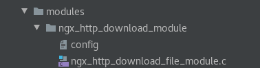
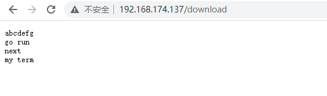
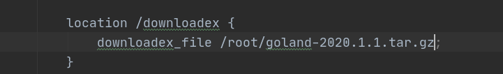

## 文件下载和断点续传实现

源代码和配置文件在src/ngx_http_download_file_module路径下。
带参数的文件下载和断点续传在src/ngx_http_downloadex_module路径下。

```bash
./configure --prefix=/usr/local/nginx --add-module=src/modules/ngx_http_download_file_module
python makefile2cmakelist.py objs/Makefile CMakeLists.txt
```

文件断点续传也是http handler处理模块。

handler模块只需要这几件事情。
1. 编写模块基本结构。包括模块的定义，模块上下文结构，模块的配置结构等。
2. 实现handler的挂载函数。根据模块的需求选择正确的挂载方式。
3. 编写handler处理函数。模块的功能主要通过这个函数来完成。

代码在src/ngx_http_download_file_module下能找到。

配置文件如下:

```bash
ngx_addon_name=ngx_http_download_module
HTTP_MODULES="$HTTP_MODULES ngx_http_download_module"
NGX_ADDON_SRCS="$NGX_ADDON_SRCS $ngx_addon_dir/ngx_http_download_file_module.c"
```
这里要注意ngx_http_download_module最好和你的文件夹名保持一致。

这里多说明以下命令数组模块。

```c
static ngx_command_t ngx_http_download_commands[] =
{
    {
        ngx_string("download_file"), // nginx的配置命令
        NGX_HTTP_LOC_CONF | NGX_CONF_NOARGS,// 配置的范围和要求
        ngx_http_download,
        NGX_HTTP_LOC_CONF_OFFSET, // 就从取到的配置的第一个字符开始算
        0,						 // 偏移量为0(无参数)
        NULL
    },
 
    ngx_null_command
};
```
命令数组第一个元素有四个部分:

1. 配置的命令

2. 配置的范围和要求,具体例子如下
比如NGX_HTTP_SRV_CONF就是该模块可以放到配置文件http的server块中 下面是例子
```
NGX_HTTP_MAIN_CONF | NGX_HTTP_SRV_CONF | NGX_HTTP_LOC_CONF | NGX_HTTP_LMT_CONF | NGX_CONF_NOARGS
```
除了可指明放入配置块的位置还可指明后面的参数 比如NGX_CONF_NOARGS就指明了配置块无参数
 
3. 回调函数

4. 提取到配置文件关键字后怎么读取字符

5. 偏移量

6. NULL

带参数的文件断点传续模块命令模块,可以看到几乎是一致的。只改变了配置的范围和要求。

```c
static ngx_command_t ngx_http_downloadex_commands[]={
        {
          ngx_string("downloadex_file") ,
          NGX_HTTP_LOC_CONF|NGX_CONF_TAKE1,
          ngx_http_downloadex,
          NGX_HTTP_LOC_CONF_OFFSET,
          0,
          NULL
        },
        ngx_null_command
};
```

下面是配置处理代码:

```c
// 配置处理,处理配置就会指定调用函数。 
static char *ngx_http_download(ngx_conf_t *cf, ngx_command_t *cmd, void *conf)
{
    ngx_http_core_loc_conf_t  *clcf;

    /* 首先找到download_file配置项所属的配置块，clcf貌似是location块内的数据
     结构，事实上不然。它能够是main、srv或者loc级别配置项，也就是说在每一个
     http{}和server{}内也都有一个ngx_http_core_loc_conf_t结构体 */
    clcf = ngx_http_conf_get_module_loc_conf(cf, ngx_http_core_module);

    /* http框架在处理用户请求进行到NGX_HTTP_CONTENT_PHASE阶段时。假设
      请求的主机域名、URI与download_file配置项所在的配置块相匹配，就将调用我们
      实现的ngx_http_download_handler方法处理这个请求
    */
    clcf->handler = ngx_http_download_handler;

    return NGX_CONF_OK;
}
```
注意到配置处理的`clcf->handler = ngx_http_download_handler;` 这一句就是http框架在处理用户请求进行到NGX_HTTP_CONTENT_PHASE阶段时。假设请求的主机域名、URI与download_file配置项所在的配置块相匹配，就将调用我们实现的`ngx_http_download_handler`方法处理这个请求

所以nginx模块关键是看真正的处理函数。
```c
// 读取文件,发送到客户端
static ngx_int_t ngx_http_download_handler(ngx_http_request_t *r)
{
    // 1. 判断用户发过来的请求
    // 必须是GET或者HEAD方法，否则返回405 Not Allowed
    if (!(r->method & (NGX_HTTP_GET | NGX_HTTP_HEAD)))
        return NGX_HTTP_NOT_ALLOWED;

    // 丢弃请求中的包体
    ngx_int_t rc = ngx_http_discard_request_body(r);
    if (rc != NGX_OK)
        return rc;

    // 2. 打开指定文件(除开套路外的实际功能代码)
    ngx_buf_t *b = NULL;
    b = ngx_palloc(r->pool, sizeof(ngx_buf_t)); // 类似于malloc
    if(b == NULL)
        return NGX_HTTP_INTERNAL_SERVER_ERROR;

    u_char* filename = (u_char*)"/tmp/test.txt";   // 要打开的文件名称
    b->in_file = 1;     // 设置为1表示缓冲区中发送的是文件

    // 分配代表文件的结构体空间。file成员表示缓冲区引用的文件
    b->file = ngx_pcalloc(r->pool, sizeof(ngx_file_t));
    b->file->fd = ngx_open_file(filename, NGX_FILE_RDONLY | NGX_FILE_NONBLOCK, NGX_FILE_OPEN, 0);// 接收返回的文件fd
    b->file->log = r->connection->log;  // 连接的日志对象付给当前,日志能输出了
    b->file->name.data = filename;      // name成员表示文件名称称
    b->file->name.len = sizeof(filename) - 1;
    if (b->file->fd <= 0)		// 文件不存在时
        return NGX_HTTP_NOT_FOUND;

    r->allow_ranges = 1;    //支持断点续传

    // 获取文件长度，ngx_file_info方法封装了stat系统调用 => 要返回给用户要获取文件的长度,http协议有content_length
    // info成员就表示stat结构体
    if (ngx_file_info(filename, &b->file->info) == NGX_FILE_ERROR)
        return NGX_HTTP_INTERNAL_SERVER_ERROR;

    // 设置缓冲区指向的文件块
    b->file_pos = 0;                        // 文件起始位置
    b->file_last = b->file->info.st_size;   // 文件结束为止

    // 用于告诉HTTP框架。请求结束时调用cln->handler成员函数
    ngx_pool_cleanup_t* cln = ngx_pool_cleanup_add(r->pool, sizeof(ngx_pool_cleanup_file_t));
    if (cln == NULL)
        return NGX_ERROR;

    cln->handler = ngx_pool_cleanup_file;       // ngx_pool_cleanup_file专用于关闭文件句柄

    ngx_pool_cleanup_file_t  *clnf = cln->data; // cln->data为上述回调函数的參数
    clnf->fd = b->file->fd;
    clnf->name = b->file->name.data;
    clnf->log = r->pool->log;

    // 3. 填充返回给客户端的headers
    // 设置返回的Content-Type
    // 注意，ngx_str_t有一个非常方便的初始化宏
    // ngx_string，它能够把ngx_str_t的data和len成员都设置好
    ngx_str_t type = ngx_string("text/plain");

    //设置返回状态码
    r->headers_out.status = NGX_HTTP_OK;
    r->headers_out.content_length_n = b->file->info.st_size;    // 正文长度,要获取文件大小
    r->headers_out.content_type = type;

    // 4. 发送http头部给用户
    rc = ngx_http_send_header(r);
    if (rc == NGX_ERROR || rc > NGX_OK || r->header_only)
        return rc;

    // 5. 构造发送时的ngx_chain_t结构体
    ngx_chain_t out;
    out.buf = b;
    out.next = NULL;

    // 6.最后一步发送包体，http框架会调用ngx_http_finalize_request方法
    return ngx_http_output_filter(r, &out);
}
```

其中支持断点续传的代码为如下：

```c
r->allow_ranges = 1;    //支持断点续传
```
代码结构如下:

配置文件修改如下:

下载小的文本文件就是直接展示:

断点续传效果图:


## 带参数的断点续传

下面是编译命令:
```bash
./configure --prefix=/usr/local/nginx --add-module=src/modules/ngx_http_downloadex_module
python makefile2cmakelist.py CMakeLists.txt objs/Makefile 
```

带参数的具体看代码吧。和之前的hello差不多。

代码在src/ngx_http_downloadex_module文件夹下。

nginx的配置文件改为:



它就会自动下载配置的路径下的文件。

下一章 [过滤模块](05filter.md)