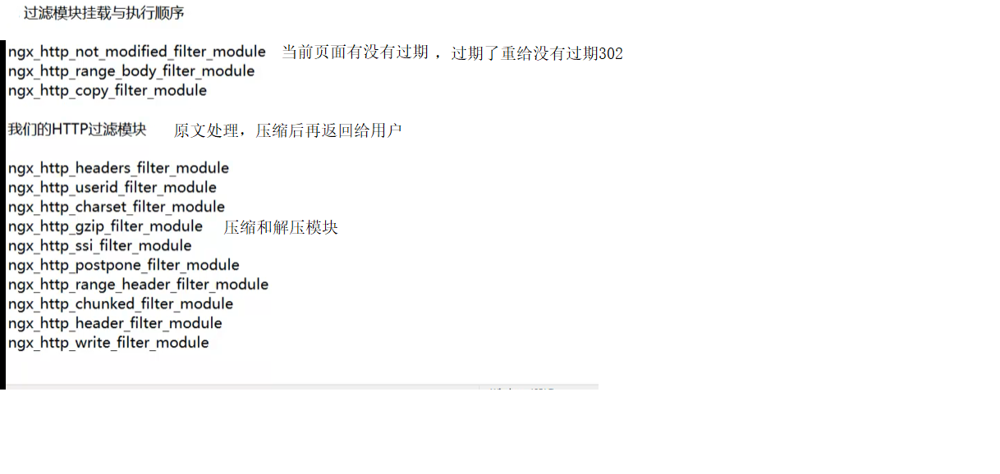
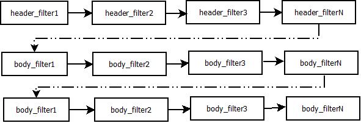
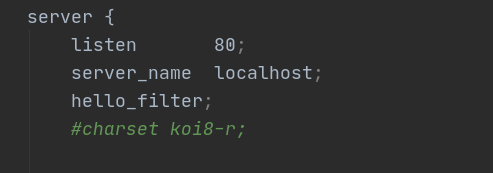
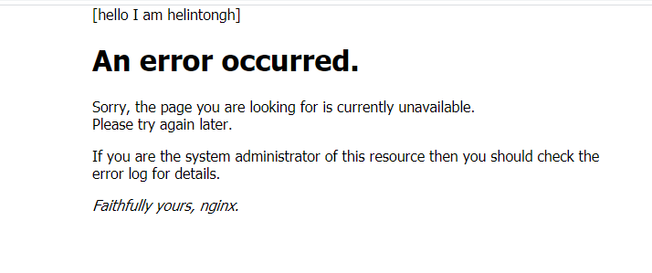
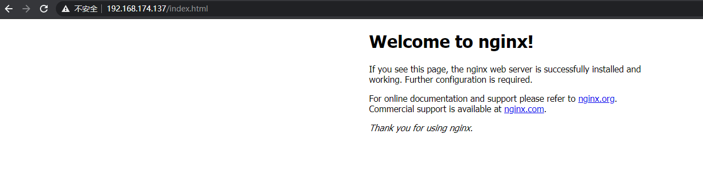
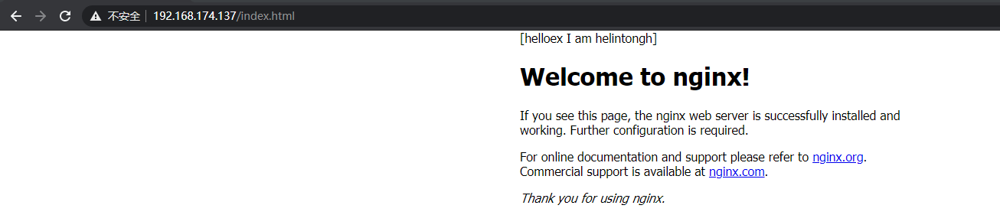

## 过滤模块

什么是过滤模块?client去请求服务器资源服务器把回复给客户端的头和内容进行处理再返回回去就是过滤模块的功能。

http模块是直接响应客户端请求。 client <------> nginx
而过滤模块则是附加响应。		client <------> nginx <-------> 响应内容(响应的内容经过了处理)


## 过滤模块执行顺序
过滤模块是有执行顺序的。我的过滤模块处于的位置如下图:



然后直接看过滤模块和HTTP模块不同之处。nginx针对过滤模块维护了两条链ngx_http_output_header_filter_pt和ngx_http_output_body_filter_pt。

这是过滤链表的入口。ngx_http_output_header_filter_pt是http头过滤链表,ngx_http_output_body_filter_pt是body体的过滤链表
```c
static ngx_http_output_header_filter_pt ngx_http_next_header_filter;
static ngx_http_output_body_filter_pt ngx_http_next_body_filter;
```

换句话说我们不在需要实现handler命令行里的回调函数了,只需要把过滤函数挂载链上即可。

```c
static ngx_command_t ngx_http_hello_filter_commands[] = {
        { ngx_string("hello_filter"), // 命令的名字
          NGX_HTTP_SRV_CONF|NGX_HTTP_LOC_CONF|NGX_CONF_NOARGS,
          ngx_http_hello_filter, // nginx需要执行该指针指向的函数
          0,
          0,
          NULL },
        ngx_null_command
};
```
```c
static char *ngx_http_hello_filter(ngx_conf_t *cf, ngx_command_t *cmd, void *conf)
{
    return NGX_CONF_OK;
}
```
可以看到命令行注册的回调函数不需要实现。

然后ngx_http_hello_filter_init就把过滤的回调函数放入了nginx的过滤流程里面。
ngx_http_hello_filter_header_filter是http头的过滤函数。
ngx_http_myfilter_filter_body_filter是http body的过滤函数。

> 这里做一个说明为啥body体的不叫ngx_http_hello_filter_header_filter那是因为clion 2020编译的时候会报一个错误undeclared (first use in this function) in C。我看了很久觉得是CMake版本的问题就此修改。
```c
// 过滤模块链表入口
static ngx_http_output_header_filter_pt ngx_http_next_header_filter;
static ngx_http_output_body_filter_pt ngx_http_next_body_filter;

static ngx_int_t ngx_http_hello_filter_init(ngx_conf_t *cf)
{
    // ngx_http_top_header_filter链表表头,插入到头部处理方法链表的首部
    ngx_http_next_header_filter = ngx_http_top_header_filter;
    // ngx_http_hello_filter_header_filter函数占据表头并执行
    ngx_http_top_header_filter = ngx_http_hello_filter_header_filter;
    // 插入到包体处理方法链表的首部
    ngx_http_next_body_filter = ngx_http_top_body_filter;
    ngx_http_top_body_filter = ngx_http_myfilter_filter_body_filter;

    return NGX_OK;
}
```

接下来着重关注两个重要的函数ngx_http_hello_filter_header_filter和ngx_http_myfilter_filter_body_filter。
 该函数做4个事情
1. 判断请求的状态是否为200,不是则不处理
2. 判断当前请求是否处理过,否则不处理
3. 申请上下文结构体内存,并赋初值
4. 判断文件类型是否符合要求,不符合要求不处理
5. 判断原本返回的响应有无内容,无则不处理

```c

static ngx_int_t ngx_http_hello_filter_header_filter(ngx_http_request_t *r)
{
    ngx_http_hello_filter_ctx_t *ctx;// 上下文变量
    // 用户请求状态码是否是200
    if(r->headers_out.status != NGX_HTTP_OK)
    {
        return ngx_http_next_header_filter(r); // 走到下一个过滤模块(不走自己写的过滤模块)
    }
    ctx = ngx_http_get_module_ctx(r, ngx_http_hello_filter_module);
    if(ctx) // 取出的不为空,已经处理过。走下一个过滤模块
    {
        return ngx_http_next_header_filter(r);
    }
    // 没有处理过,申请内存
    ctx = ngx_pcalloc(r->pool, sizeof(ngx_http_hello_filter_module));
    if(ctx == NULL)
    {
        return NGX_ERROR;
    }
    // ctx的变量赋值
    ctx->add_prefix = 0;
    // 把ctx设置到ngx_http_hello_filter_module模块中
    ngx_http_set_ctx(r, ctx, ngx_http_hello_filter_module);
    // 比较当前的类型,如果是一个网页才进行处理
    if(r->headers_out.content_type.len >= sizeof("text/html") - 1 &&
       ngx_strncasecmp(r->headers_out.content_type.data, (u_char *)"text/html",sizeof("text/html") - 1) == 0)
    {
        ctx->add_prefix = 1;
        if(r->headers_out.content_length_n > 0) // 当前返回内容要大于0
        {
            r->headers_out.content_length_n += filter_prefix.len;
        }

    }
    return ngx_http_next_header_filter(r);
}
```

1. 取出上下文,上下文不符合要求不处理
2. 标记上下文,避免重复操作
3. 申请内存,并存储前缀内容
4. 挂载到处理链表中并返回链表
```c
static ngx_int_t ngx_http_myfilter_filter_body_filter(ngx_http_request_t *r, ngx_chain_t *in)
{
    ngx_http_hello_filter_ctx_t *ctx; // 定义上下文
    ctx = ngx_http_get_module_ctx(r, ngx_http_hello_filter_module);// 取出上下文
    /* 如果获取不到上下文,或者上下文结构体中的hello_filter为0或者2,都不会加前缀,
            这里直接交给下一个HTTP过滤模块处理*/
    if(ctx == NULL || ctx->add_prefix != 1)// 是否为空或已经处理过
    {
        return ngx_http_next_body_filter(r, in); // 走下一条
    }
    // 设置为2,这样即使ngx_http_hello_filter_body_filter再次回调时,也不会重复添加前缀
    ctx->add_prefix = 2;// 没处理过赋值为2
    ngx_buf_t *b = ngx_create_temp_buf(r->pool, filter_prefix.len);
    // 将ngx_buf_t中的指针正确地指向字符串
    b->start = b->pos = filter_prefix.data;
    b->last = b->pos + filter_prefix.len;
    // 从请求的内存池中生成ngx_chain_t链表,将刚分配的ngx_buf_t设置到buf成员中,并将它添加到原先待发送的HTTP包体前
    ngx_chain_t *cl = ngx_alloc_chain_link(r->pool);
    cl->buf = b;
    cl->next = in;
    // 调用下一个模块的HTTP包体处理方法,注意,这时传入的是新生成的cl链表
    return ngx_http_next_body_filter(r, cl);
}
```
nginx要加如下配置,于此同时还要注意该配置还可以加到location块中。



结果如下图:



可以看到访问index.html和50x.html都会在最前面加上前缀[hello I am helintongh]这代表过滤模块生效了。

## 带参数的过滤模块

请直接看代码。就只是新增了参数的处理和参数的合并而已。

```c
#include <ngx_config.h>
#include <ngx_core.h>
#include <ngx_http.h>

static ngx_int_t ngx_http_helloex_filter_init(ngx_conf_t *cf);
static ngx_int_t ngx_http_helloex_filter_header_filter(ngx_http_request_t *r);
static ngx_int_t ngx_http_myfilterex_filter_body_filter(ngx_http_request_t *r, ngx_chain_t *in);
static void* ngx_http_helloex_filter_create_conf(ngx_conf_t *cf);
static char* ngx_http_helloex_filter_merge_conf(ngx_conf_t *cf, void *parent, void *child);
// 过滤模块链表入口
static ngx_http_output_header_filter_pt ngx_http_next_header_filter;
static ngx_http_output_body_filter_pt ngx_http_next_body_filter;
// 前缀定义
static ngx_str_t filter_prefix = ngx_string("[helloex I am helintongh]");

// 定义保存参数的结构体
typedef struct
{
    ngx_flag_t enable;
}ngx_http_helloex_filter_conf_t;

static ngx_command_t ngx_http_helloex_filter_commands[] = {
        { ngx_string("helloex_filter"), // 命令的名字
          NGX_HTTP_SRV_CONF|NGX_HTTP_LOC_CONF|NGX_CONF_FLAG,
          ngx_conf_set_flag_slot, // nginx需要执行该指针指向的函数
          NGX_HTTP_LOC_CONF_OFFSET,
          offsetof(ngx_http_helloex_filter_conf_t, enable),
          NULL },
        ngx_null_command
};
// 上下文结构体
typedef struct {
    ngx_uint_t add_prefix;
}ngx_http_helloex_filter_ctx_t;

static ngx_http_module_t  ngx_http_helloex_filter_module_ctx = {
        NULL,    							   /* preconfiguration */
        ngx_http_helloex_filter_init,            /* postconfiguration */
        NULL,                                  /* create main configuration */
        NULL,                                  /* init main configuration */
        NULL,                                  /* create server configuration */
        NULL,                                  /* merge server configuration */
        ngx_http_helloex_filter_create_conf,   /* create location configuration */
        ngx_http_helloex_filter_merge_conf    /* merge location configuration */
};

ngx_module_t  ngx_http_helloex_filter_module = {
        NGX_MODULE_V1,
        &ngx_http_helloex_filter_module_ctx,      /* module context */
        ngx_http_helloex_filter_commands,              /* module directives */
        NGX_HTTP_MODULE,                       /* module type */
        NULL,                                  /* init master */
        NULL,                                  /* init module */
        NULL,                                  /* init process */
        NULL,                                  /* init thread */
        NULL,                                  /* exit thread */
        NULL,                                  /* exit process */
        NULL,                                  /* exit master */
        NGX_MODULE_V1_PADDING
};

static void* ngx_http_helloex_filter_create_conf(ngx_conf_t *cf)
{
    // 当前结构体指针
    ngx_http_helloex_filter_conf_t *mycf;
    // 创建存储配置项的结构体,获取相应配置
    mycf = (ngx_http_helloex_filter_conf_t*)ngx_pcalloc(cf->pool, sizeof(ngx_http_helloex_filter_conf_t));
    if(mycf == NULL)
    {
        return NULL;
    }
    // ngx_flag_t类型的变量。如果使用预设函数ngx_conf_set_flag_slot解析配置项参数,那么必须初始化为NGX_CONF_UNSET
    mycf->enable = NGX_CONF_UNSET;
    return mycf;
}
// 合并配置项,由于该命令会出现在两个块中
static char*
ngx_http_helloex_filter_merge_conf(ngx_conf_t *cf, void *parent, void *child)
{
    ngx_http_helloex_filter_conf_t *prev = (ngx_http_helloex_filter_conf_t *)parent;
    ngx_http_helloex_filter_conf_t *conf = (ngx_http_helloex_filter_conf_t *)child;
    // 合并ngx_flat_t类型的配置项enable
    ngx_conf_merge_value(conf->enable, prev->enable, 0);
    return NGX_CONF_OK;
}


static ngx_int_t ngx_http_helloex_filter_init(ngx_conf_t *cf)
{
    // ngx_http_top_header_filter链表表头,插入到头部处理方法链表的首部
    ngx_http_next_header_filter = ngx_http_top_header_filter;
    // ngx_http_helloex_filter_header_filter函数占据表头并执行
    ngx_http_top_header_filter = ngx_http_helloex_filter_header_filter;
    // 插入到包体处理方法链表的首部
    ngx_http_next_body_filter = ngx_http_top_body_filter;
    ngx_http_top_body_filter = ngx_http_myfilterex_filter_body_filter;

    return NGX_OK;
}


// 处理http协议头
/* 该函数做4个事情
1. 判断请求的状态是否为200,不是则不处理
2. 判断当前请求是否处理过,否则不处理
相较于无参模块: 获取配置,如果参数为off,则不处理
3. 申请上下文结构体内存,并赋初值
4. 判断文件类型是否符合要求,不符合要求不处理
5. 判断原本返回的响应有无内容,无则不处理
*/
static ngx_int_t ngx_http_helloex_filter_header_filter(ngx_http_request_t *r)
{
    ngx_http_helloex_filter_ctx_t *ctx;// 上下文变量
    ngx_http_helloex_filter_conf_t *conf; // 保存配置用的
    // 用户请求状态码是否是200,如果不是200成功,那么这时是不需要理会是否加前缀的.直接交由下一个过滤模块处理响应
    if(r->headers_out.status != NGX_HTTP_OK)
    {
        return ngx_http_next_header_filter(r); // 走到下一个过滤模块(不走自己写的过滤模块)
    }
    // 获取http上下文
    ctx = ngx_http_get_module_ctx(r, ngx_http_helloex_filter_module);
    if(ctx) // 取出的不为空,已经处理过。走下一个过滤模块
    {
        return ngx_http_next_header_filter(r);
    }
    // 获取存储配置项的ngx_http_helloex_filter_module
    conf = ngx_http_get_module_loc_conf(r, ngx_http_helloex_filter_module);
    // 如果enable成员为0,也就是配置文件中没有配置helloex_filter配置项,或者helloex_filter配置项的参数值是off,那么这时直接交由下一个过滤模块处理
    if(conf->enable == 0)
    {
        return ngx_http_next_header_filter(r); // 参数为off则之间进入下一个链表
    }
    // 没有处理过,申请内存。构造HTTP上下文结构体ngx_http_helloex_filter_module
    ctx = ngx_pcalloc(r->pool, sizeof(ngx_http_helloex_filter_module));
    if(ctx == NULL)
    {
        return NGX_ERROR;
    }
    // ctx的变量赋值为0表示不加前缀
    ctx->add_prefix = 0;
    // 将构造的上下文设置到当前请求中
    ngx_http_set_ctx(r, ctx, ngx_http_helloex_filter_module);
    // 我的过滤模块只处理Content-Type是"text/plain"类型的HTTP响应
    if(r->headers_out.content_type.len >= sizeof("text/html") - 1 &&
       ngx_strncasecmp(r->headers_out.content_type.data, (u_char *)"text/html",sizeof("text/html") - 1) == 0)
    {
    	// 设置为1表示需要在HTTP包体前加入前缀
        ctx->add_prefix = 1;
        /* 当前处理模块已经在Content-Length中写入了HTTP包体的长度时,由于我们加入了前缀字符串,
        		所以需要把这个字符串的长度也加入到Content-Length中
        */
        if(r->headers_out.content_length_n > 0) // 当前返回内容要大于0
        {
            r->headers_out.content_length_n += filter_prefix.len;
        }

    }
    return ngx_http_next_header_filter(r);
}
// 处理http的body体
/*
1. 取出上下文,上下文不符合要求不处理
2. 标记上下文,避免重复操作
3. 申请内存,并存储前缀内容
4. 挂载到处理链表中并返回链表
*/
static ngx_int_t ngx_http_myfilterex_filter_body_filter(ngx_http_request_t *r, ngx_chain_t *in)
{
    ngx_http_helloex_filter_ctx_t *ctx; // 定义上下文
    ctx = ngx_http_get_module_ctx(r, ngx_http_helloex_filter_module);// 取出上下文
    /* 如果获取不到上下文,或者上下文结构体中的add_prefix为0或者2时,都不会添加前缀
    		这时直接交给下一个HTTP过滤模块处理*/
    if(ctx == NULL || ctx->add_prefix != 1)// 是否为空或已经处理过
    {
        return ngx_http_next_body_filter(r, in); // 走下一条
    }
    // 赋值为2就会使ngx_http_myfilterex_filter_body_filter再次回调时,也不会添加前缀
    ctx->add_prefix = 2;// 没处理过赋值为2
    // 从请求的内存池中分配内存,用于存储字符串前缀
    ngx_buf_t *b = ngx_create_temp_buf(r->pool, filter_prefix.len);
    // 将ngx_buf_t中的指针正确地指向filter_prefix字符串
    b->start = b->pos = filter_prefix.data;
    b->last = b->pos + filter_prefix.len;
    /* 从请求的内存池中生成ngx_chain_t链表,将刚分配的ngx_buf_t设置到buf成员中,
    		并将它添加到原先待发送的HTTP包体前面 */
    ngx_chain_t *cl = ngx_alloc_chain_link(r->pool);
    cl->buf = b;
    cl->next = in;
    return ngx_http_next_body_filter(r, cl);
}
```


效果如下:


可以看到没有新增前缀。

把配置里的off改为on。

效果如下:


